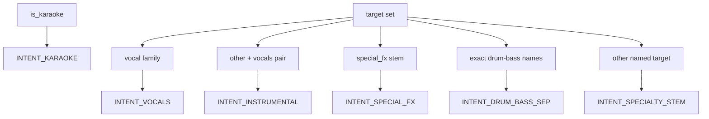

# Stem-semantics and catalogue intent overlay

> **For agentic workers:** REQUIRED SUB-SKILL: Use superpowers:subagent-driven-development (recommended) or superpowers:executing-plans to implement this plan task-by-task. Steps use checkbox (`- [ ]`) syntax for tracking.

**Goal:** Fix stem-intent rules in `model_stem_semantics`, then make catalogue `EntryMeta` prefer yaml-derived intent over coarse mvsepless shop categories so BGM/Scratch/Wind-Chimes (and the Download Center filters) stop lying.

**Architecture:** Two required layers: (1) correct field inference in [`core/model_stem_semantics.py`](../../../core/model_stem_semantics.py), (2) stamp that on [`EntryMeta.intent`](../../../core/catalog_sources.py) instead of letting a coarse mvsepless shop category win. Runtime invert/export (`is_vocal_target`, `pick_vocal_key`, `pick_instrumental_key`) stays conservative.

Without (2), BGM / Scratch / Wind-Chimes stay wrong in the Download Center even after (1). Generator auditor, PolarFormer ensemble buckets, and Apollo restore stay optional.

**Tech Stack:** Python 3.x, stdlib `unittest`, basedpyright. No new dependencies.

## Tasks

- [ ] Add `is_vocal_family_stem`; keep `is_vocal_target` closed for engines
- [ ] Gate `other`→instrumental on vocals+other; fx sibling → special_fx; 4-stem other → multi_stem
- [ ] Unknown named targets → specialty; tighten drum-bass pair and drop substring drum+bass
- [ ] Karaoke backend_focus + export notes: lead/vocal-side vs backing, no instrumental default
- [ ] TDD the catalogue cases in `tests/test_model_stem_semantics.py`
- [ ] Map `Ударные`/`Бас` to specialty; keep DrumSep as `drum_bass_sep`
- [ ] Resolve `EntryMeta.intent` via `export_intent_from_fields` when confident; category only fills unknown
- [ ] Tests in `test_mvsepless_catalog` + `test_catalog_sources`; unittest + basedpyright

## Issue list and decisions

**Keep: 2-stem yaml `other` is Instrumental.** Comment at [`VOCALS_OTHER_DISPLAY_OVERRIDES`](../../../core/model_stem_semantics.py) is still right: Kim Inst-style `vocals`+`other` with `target_instrument=other` is the backing track. Display overrides, `pick_instrumental_key` (`len(sources) <= 2`), and [`export_stem_label` 2-stem other](../../../core/stems.py) stay. Test [`test_vocals_other_yaml_is_instrumental_when_target_other`](../../../tests/test_model_stem_semantics.py) stays green.

**Change: `target == "other"` is not enough.** [`export_intent_from_fields`](../../../core/model_stem_semantics.py) currently returns `INTENT_INSTRUMENTAL` as soon as `target.lower() in ("instrumental", "inst", "other")`, before looking at the pair. That is why **Yuluoye DeNoise** (`dry`+`other`, target `other`) becomes instrumental while **Aufr33** (`target=dry`) stays special_fx. New rule:

- `other` → instrumental only when the instrument list is a vocals+other (or vocal+other) pair
- if the sibling is a special-fx stem (`dry`, `noise`, `reverb`, …) → `INTENT_SPECIAL_FX`
- if `len(instruments) >= 3` → `INTENT_MULTI_STEM` (MUSDB residual, not a backing track)
- otherwise a named source plus residual `other` → `INTENT_SPECIALTY_STEM` (e.g. `wind`+`other`)

**Keep: `is_vocal_target` closed.** It is the engine invert predicate ([`engines/mdx_c.py`](../../../engines/mdx_c.py), [`engines/stem_writer.py`](../../../engines/stem_writer.py), [`core/model_data.py`](../../../core/model_data.py)). `lead`, `Voices`, `vox`, `singer_1` must not start the Vocals invert path. Do not expand it.

**Add: vocal-family helper for intent/focus only.** New `is_vocal_family_stem()` (name can be bikeshed in code) covering `vocals`/`vocal`/`voc` plus unambiguous catalogue spellings: `voices`, `vox`, `lead-vocal`, `lead_vocal`. Not bare `lead` (already specialty; karaoke handles it separately). Not `singer_1`/`singer_2` (duet → specialty 2-stem). Use it in `export_intent_from_fields`, `intent_from_primary_stem`, `backend_focus_label`, and karaoke notes. `normalize_stem_label` can map the hyphenated vocal spellings to `Vocals` for focus labels without changing `canonical_stem_alias` in [`core/stems.py`](../../../core/stems.py).

**Change: karaoke focus must not default to instrumental.** [`backend_focus_label`](../../../core/model_stem_semantics.py) today: if karaoke and the stem is not `Vocals`/`Instrumental`, return `karaoke_instrumental_primary`. PolarFormer Karaoke is `lead`/`back_instrum` with target `lead`, so the catalogue says “backing” while the yaml primary is the vocal side. New karaoke branch:

- vocal-family or `lead` (specialty vocal-side) → `karaoke_vocal_primary`
- inst-family, `other` on a 2-stem pair, or `back_instrum` / backing tokens → `karaoke_instrumental_primary`
- else `karaoke_unknown_primary` (no silent default)

Same split in `recommended_export_note` instead of the current “backing is typically desired” fallback.

**Change: unknown named targets are specialty, not `unknown`.** After the target switch, anything with a non-empty target that is not voc/inst/fx/drum-bass/multi-component should return `INTENT_SPECIALTY_STEM`. That is what Mega 53 `wind` / `wind-chimes` already look like in the UI (`single_target:wind-chimes`). Today `export_intent_from_fields` returns `unknown` for those, and the generated doc’s `drum_bass_sep` on Wind-Chimes does **not** come from `"drum" in "wind-chimes"` (live call is `unknown`).

**Change: `is_drum_bass_pair` is a 2-stem pair.** Match [`is_specialty_instrument_pair`](../../../core/model_stem_semantics.py) / [`is_vocals_other_pair`](../../../core/model_stem_semantics.py): `len == 2` and the set is `{no drum-bass, drum-bass}`. Today any instrument list that *contains* those names wins, which would mis-file a 53-stem yaml that happens to include them.

**Change: drop `"drum" in t and "bass" in t`.** Same two call sites (`intent_from_primary_stem`, `export_intent_from_fields`, `backend_focus_label`). Use the exact pair tokens / `is_drum_bass_pair` instead. Latent footgun; Wind-Chimes was not this bug.

**Keep: `backend_focus_label` `two_stem` when there is no target.** HP-Vocal / D1581 flags (`vocals` vs `two_stem`) are the generator’s `_intent_compatible` requiring `focus.startswith("vocal")`. Core is telling the truth: VR/MDX23C 2-stem with primary Vocals and no `target_instrument`. Do not lie with `vocal_primary`. Generator flagging is optional (below).

**Keep: Apollo as `unknown` in stem-semantics.** Restore is an audio tool, not a stem model. Optional purpose-bucket follow-up below.

## Required: category table + yaml-beats-category

BGM / Scratch `specialty_stem` on a `vocal_target` yaml, and Wind-Chimes `drum_bass_sep`, are [`EntryMeta.intent`](../../../core/catalog_sources.py) from [`_CATEGORY_TABLE`](../../../core/mvsepless_catalog.py) (`Скретч` → specialty, `Ударные`/`Бас` → `INTENT_DRUM_BASS_SEP`) applied when the name guess is `unknown`. Download Center filters use that via [`purpose_for_label`](../../../core/model_scores.py).

**Category table.** `Ударные` and `Бас`/`Басс` → `INTENT_SPECIALTY_STEM` (single-source extractors). Keep `DrumSep` as `INTENT_DRUM_BASS_SEP`. Leave choir / male-female as `INTENT_VOCALS` at category level; a male/female yaml pair already becomes specialty from fields, and overlay will prefer that. Scratch/BGM stay specialty as a category fallback only.

**Overlay.** Add `resolve_catalogue_intent(...)` in [`core/model_stem_semantics.py`](../../../core/model_stem_semantics.py): `export_intent_from_fields` if not `unknown`, else category intent, else `unknown`. Call it when building `EntryMeta` in [`core/catalog_sources.py`](../../../core/catalog_sources.py) (after `lookup_stems`, with `resolve_is_karaoke(model_name=label)`). Do not only fix [`_apply_entry_meta`](../../../scripts/generate_models_catalogue.py) — the GUI would still show the shop category. Once `EntryMeta.intent` is right, the generator copies it when name-intent is still `unknown`.

That is the actual BGM/Scratch fix (yaml vocals beats `Скретч`). Wind-Chimes becomes specialty from the named-target rule once yaml is cached; the category-table change covers the no-yaml fallback so `Ударные` is not drum/bass separation.

## Implementation

**Stem-semantics** ([`core/model_stem_semantics.py`](../../../core/model_stem_semantics.py)):

1. Add `is_vocal_family_stem` next to `is_vocal_target`. Keep `is_vocal_target` as `vocals`/`vocal`/`voc`.
2. Rewrite the `if target:` block in `export_intent_from_fields` (other-pair / fx-sibling / vocal-family / exact drum-bass / leftover→specialty). Move `other` off the bare inst tuple.
3. Tighten `is_drum_bass_pair`; replace substring drum+bass checks.
4. Fix karaoke branch of `backend_focus_label` and `recommended_export_note`.
5. When intent is special_fx but target is `other`, describe the fx sibling (`dry`).
6. Add `resolve_catalogue_intent` as the single precedence helper.

**Catalogue:**

7. Remap `Ударные` / `Бас` / `Басс` in [`core/mvsepless_catalog.py`](../../../core/mvsepless_catalog.py).
8. In [`core/catalog_sources.py`](../../../core/catalog_sources.py) `_entries_from_converted` (or the `EntryMeta(...)` constructor site around the `lookup_stems` fill), set `intent=resolve_catalogue_intent(...)`.

## Tests

[`tests/test_model_stem_semantics.py`](../../../tests/test_model_stem_semantics.py):

- Kim Inst `target=other`, `instruments=[other, vocals]` still `INTENT_INSTRUMENTAL`
- Yuluoye `target=other`, `instruments=[dry, other]` → `INTENT_SPECIAL_FX`
- 4-stem `target=other` → `INTENT_MULTI_STEM`
- `wind-chimes`+`other` → `INTENT_SPECIALTY_STEM`, focus still `single_target:wind-chimes`
- PolarFormer karaoke `lead`/`back_instrum` → intent karaoke, focus `karaoke_vocal_primary`
- `is_vocal_target("lead-vocal")` still False; `is_vocal_family_stem("lead-vocal")` True; `is_vocal_family_stem("lead")` False
- `is_drum_bass_pair` false for a 4+-stem list that merely contains `drum-bass`
- `resolve_catalogue_intent`: yaml vocals + category specialty → vocals; yaml unknown + category specialty → specialty
- existing karaoke, crowd-vs-denoise, MDX Main dual, HP-UVR inst tests stay

[`tests/test_mvsepless_catalog.py`](../../../tests/test_mvsepless_catalog.py): `Ударные`/`Бас` → specialty; `DrumSep` still drum_bass_sep.

[`tests/test_catalog_sources.py`](../../../tests/test_catalog_sources.py): `EntryMeta.intent` prefers fields over category when stems/target are present.

Run: `.venv/bin/python -m unittest tests.test_model_stem_semantics tests.test_vocal_split_stems tests.test_stems_typed tests.test_mvsepless_catalog tests.test_catalog_sources tests.test_generate_models_catalogue -v` and basedpyright on the touched modules.

Do not regenerate [`docs/models-catalogue.md`](../../models-catalogue.md) unless asked. After this lands a regen would actually fix BGM/Scratch/Wind-Chimes; leave that as a separate commit.

## Optional follow-ups (not this pass)

- **Karaoke identity in [`core/stems.py`](../../../core/stems.py).** PolarFormer `lead` / `back_instrum` bucket as `UNKNOWN`, so ensembles will not combine them with other karaoke Vocals/Inst-with-BV members. Map `lead` → `LEAD_VOCALS` and `back_instrum` → `INST_WITH_BV` only under `is_karaoke`. Optional extras: `voices` / `vox` / `lead-vocal` aliases. Keep `is_vocal_target` closed.
- **Generator auditor.** `_intent_compatible`: vocals accepts `two_stem` for voc/inst (or voc/other) and `single_target:` when vocal-family (HP-Vocal / D1581 / Lead-Vocal flags). `_unsupported_count` should accept any `Mapping` (`CatalogueSnapshot.unsupported` is a `MappingProxyType`). Drop `_finalize_entry`’s `special_fx` → `instrumental` correction. Best-result copy: FoxJoy Noise polarity; Crowd HQ remove vs MelBand Crowd isolate.
- **Apollo restore purpose** in [`core/model_scores.py`](../../../core/model_scores.py) or keep them on the Apollo page only. No `INTENT_RESTORE` in stem export.
- **Probe / extras+Politrees** inventory coverage, independent of semantics.
