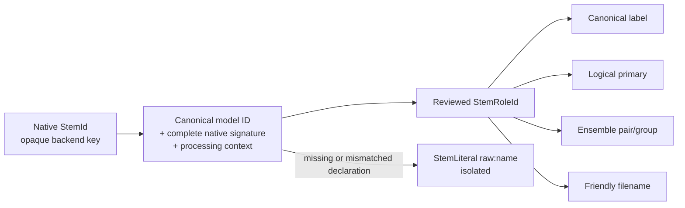

# Catalogue-Wide Stem Semantics and Canonical Naming Design

**Date:** 2026-08-24

**Status:** Approved, ready for implementation

**Scope:** Model-output identity, canonical stem names, logical primary outputs,
catalogue intent, export naming, and ensemble compatibility

**Related:**

- [Stem identity: native keys never mutate](2026-08-17-stem-identity-design.md)
- [Stem export semantics](2026-08-09-stem-export-semantics-design.md)
- [Ensemble stem semantics](2026-07-31-ensemble-stem-semantics-design.md)
- [Model display quality and backfill revision](2026-08-24-model-display-quality-and-backfill-revision-design.md)

## Summary

The current stem layer correctly preserves native yaml/hash keys, but its
semantic vocabulary is too small and too dependent on global aliases. The
public catalogue contains 148 literal spellings, 123 case-folded backend names,
and 92 distinct backend-primary names across 485 entries. A single token such
as `other`, `lead`, `inst`, or `dry` can describe different audio content in
different models.

This design adds a reviewed, canonical-ID-aware semantic declaration for every
current catalogue model. The declaration maps exact backend outputs to stable
semantic role IDs, canonical display/export names, a reviewed model intent, a
logical primary, and compatible ensemble pairs. Native backend keys and backend
primary/target metadata remain unchanged for model execution.

Unknown custom models and newly published catalogue models without a bundled
declaration remain raw and ensemble-isolated. No fuzzy, filename-derived, or
author-derived semantic inference is introduced.



## Supersession and Preserved Invariants

This design supersedes these earlier decisions:

- the 2026-08-17 decision that semantic vocabulary must not use a per-model
  catalogue;
- the closed `EnsemblePair` enum and its saved pair-ID compatibility contract;
- global aliasing as the authoritative source for specialty output semantics;
  and
- backend-primary position as the user-facing meaning of “Primary Stem.”

It preserves these load-bearing invariants:

- `StemId.raw` retains the exact yaml/hash spelling used for dictionary lookup;
- canonical model identity remains `family:basename`;
- backend `primary_stem`, `target_instrument`, source order, artifacts, hashes,
  execution options, and inversion logic are not rewritten;
- display text is never inverted into model or stem identity;
- one `Settings` object may assemble several models without per-model semantic
  resolution writing back into it;
- an unknown output round-trips as `StemLiteral` and is never collapsed into a
  generic known bucket; and
- explicit stem selections remain semantic choices, while positional
  `primary`/`secondary` remain supported as user requests.

## Verified Catalogue Evidence

At design time, a fresh read-only catalogue collection produced the same 485
identities and no changes to instruments, primary stems, targets, guessed
intents, focus, or flags compared with `docs/models-catalogue.ir.json`. The IR's
document digest was stale because its rendered Markdown had drifted, not because
the stem evidence had changed. Implementation regenerates the IR before using
it as the final manifest input.

Measured catalogue facts:

- 485 post-deduplication model entries;
- 148 literal backend spellings;
- 123 case-folded backend names;
- 92 names observed as a backend primary;
- four complement-only evidence names: `drum-bass`, `no bass`, `no drums`, and
  `no other`; and
- 24 case/spelling variant groups, including `Vocals/vocals`,
  `Similarity/similarity`, and `No Dry/No dry/no dry`.

The semantic reference has 1,206 data rows: 455 reviewed declarations, 30
waivers, and every required processing-context/output row. When two runnable
mvsepless entries share a `full_name`, labels are deterministically suffixed
with their exact entry IDs before cross-source deduplication; this preserves
both artifacts without aliasing or selecting a winner.

### Confirmed ambiguity

Native `other` currently appears across seven guessed intents and means at
least five different things:

| Context | Canonical meaning |
|---|---|
| Ordinary two-stem vocal model | `Instrumental` |
| Karaoke full-mix model | `Instrumental with Backing Vocals` |
| Four-/multi-stem model | `Residual` |
| Exact target-plus-complement model | `<Target> Removed` |
| Exact `karaoke/other` model | one reviewed side of the karaoke pair |

Karaoke catalogue entries currently use all of these layouts:

- `Vocals/Instrumental` and `Instrumental/Vocals`;
- `vocals/other` and `other/vocals`;
- `lead/back_instrum`;
- `vocals/backing_vocal/instrumental`;
- `karaoke/other`; and
- a model with backend-primary metadata but no structured source list.

Spatial models use `center/wide`, `mid/side`, and
`similarity/difference`. Per the approved naming decision, all reviewed rows
project to the visible and ensemble-compatible `Center/Side` pair.

## Identity and Type Model

### Native identities

`StemId` remains the only representation of a model/yaml/hash output key:

```python
@dataclass(frozen=True, slots=True)
class StemId:
    raw: str
```

It remains case-preserving and case-insensitive only for matching. It is never
used as a friendly label, filename tag, or ensemble compatibility key.

### Semantic role IDs

Reviewed semantic identities use one validated immutable value type:

```python
ROLE_ID_RE = re.compile(
    r"^[a-z][a-z0-9]*(?:_[a-z0-9]+)*"
    r"(?:\.[a-z][a-z0-9]*(?:_[a-z0-9]+)*)+$"
)

@dataclass(frozen=True, slots=True, order=True)
class StemRoleId:
    value: str

    def __post_init__(self) -> None:
        if not ROLE_ID_RE.fullmatch(self.value):
            raise ValueError(f"invalid stem role id: {self.value!r}")
```

Role IDs are lowercase namespaced values such as:

- `vocal.vocals`;
- `vocal.lead`;
- `mix.instrumental`;
- `mix.instrumental_with_backing_vocals`;
- `instrument.guitar`;
- `instrument.guitar.removed`;
- `effect.reverb`;
- `effect.reverb.removed`;
- `spatial.center`; and
- `residual.other`.

The full role set is data-driven and extensible. Code exposes constants for
core roles, but does not define a giant enum containing every current or future
stem. Unknown model outputs remain `StemLiteral` values and are not registered
as semantic roles.

Enums are limited to genuinely closed behavior axes:

```python
class StemProcessingContext(str, Enum):
    FULL_MIX = "full_mix"
    VOCAL_SPLIT = "vocal_split"

class StemProduction(str, Enum):
    NATIVE = "native"
    DERIVED = "derived"

class StemReviewStatus(str, Enum):
    REVIEWED = "reviewed"
    WAIVED = "waived"
    RAW = "raw"

class StemRoleFamily(str, Enum):
    VOCAL = "vocal"
    MIX = "mix"
    INSTRUMENT = "instrument"
    EFFECT = "effect"
    SPATIAL = "spatial"
    CINEMATIC = "cinematic"
    RESIDUAL = "residual"
```

### Role and model projections

```python
@dataclass(frozen=True, slots=True)
class StemRoleDefinition:
    id: StemRoleId
    display: str
    filename_tag: str
    family: StemRoleFamily
    removed_of: StemRoleId | None = None

@dataclass(frozen=True, slots=True)
class SemanticStemOutput:
    native: StemId | None
    role: StemRoleId | StemLiteral
    production: StemProduction
    backend_primary: bool
    logical_primary: bool
    derived_from: tuple[StemRoleId, ...] = ()
    complement_of: StemRoleId | None = None

@dataclass(frozen=True, slots=True)
class ModelStemSemantics:
    model_id: str
    context: StemProcessingContext
    intent: str
    outputs: tuple[SemanticStemOutput, ...]
    status: StemReviewStatus
    evidence: str
    warning: str = ""
```

`StemRoute` uses the semantic role as its selection and ensemble identity. Its
existing string `concept` remains a read-only compatibility projection during
the cutover; new code reads `route.role`.

## Manifest Contract

Add `bundled/model_stem_manifest.json`:

```json
{
  "schema_version": 1,
  "roles": {
    "vocal.lead": {
      "display": "Lead Vocals",
      "filename_tag": "Lead_Vocals",
      "family": "vocal"
    }
  },
  "pairs": {
    "pair.karaoke": {
      "display": "Lead Vocals/Instrumental with Backing Vocals",
      "roles": [
        "vocal.lead",
        "mix.instrumental_with_backing_vocals"
      ]
    }
  },
  "models": {
    "mdx:example": {
      "native_signature": ["vocals", "other"],
      "intent": "karaoke",
      "contexts": {
        "full_mix": {
          "logical_primary": "vocal.lead",
          "outputs": [
            {"native": "vocals", "role": "vocal.lead"},
            {
              "native": "other",
              "role": "mix.instrumental_with_backing_vocals"
            }
          ]
        },
        "vocal_split": {
          "logical_primary": "vocal.lead",
          "outputs": [
            {"native": "vocals", "role": "vocal.lead"},
            {"native": "other", "role": "vocal.backing"}
          ]
        }
      },
      "evidence": "reviewed catalogue YAML and source metadata"
    }
  },
  "waivers": {
    "apollo:example": "restoration model has no separation stem inventory"
  }
}
```

Rules:

1. Match only an exact canonical `family:basename` ID.
2. Compare the complete case-folded native signature as an order-insensitive
   set with equal cardinality. Reject duplicate case-folded native keys.
3. If the signature differs, reject the entire declaration. Do not apply a
   partial route mapping.
4. Preserve the actual runtime native spelling in `SemanticStemOutput.native`.
5. A `vocal_split` projection is valid only when explicitly declared. Every
   model eligible for Vocal Splitter must declare it.
6. A derived output has `native: null`, `production: "derived"`, and exactly
   one non-empty dependency form: `derived_from` or `complement_of`. Native
   outputs have neither dependency form.
7. Every logical-primary role must exist exactly once in that context's output
   list.
8. Role displays and filename tags are unique after Unicode normalization and
   case-folding unless an explicit reviewed collision waiver explains why.
9. A current-catalogue model must be reviewed or explicitly waived. A newly
   encountered unknown model may be raw at runtime but fails the checked-in
   catalogue review gate.
10. Manifest loading is local, deterministic, and network-free.

The public resolver is:

```python
def resolve_model_stem_semantics(
    model_id: str,
    *,
    native_stems: Sequence[str],
    backend_primary: str = "",
    backend_target: str = "",
    context: StemProcessingContext = StemProcessingContext.FULL_MIX,
) -> ModelStemSemantics:
    ...
```

Missing IDs, missing contexts, and signature mismatches return a `RAW`
projection with `StemLiteral` outputs and an actionable diagnostic. They do not
raise during normal model inventory or job assembly.

## Canonical Naming Contract

Canonical names use Title Case, spaces, and established musical terminology.
Backend casing, underscores, storage hyphens, and singular/plural variations
do not appear in reviewed UI labels or new output filenames.

### Core vocals and mixtures

- `Vocals`
- `Lead Vocals`
- `Backing Vocals`
- `Male Vocals`
- `Female Vocals`
- `Soprano Vocals`
- `Alto Vocals`
- `Tenor Vocals`
- `Singer 1 Vocals`
- `Singer 2 Vocals`
- `Vocal Aspiration`
- `Instrumental`
- `Instrumental with Backing Vocals`
- `Instrumental with Lead Vocals`
- `Residual`
- `Residual Removed`
- `Music`
- `Music Removed`
- `Bleed`

Visible vocal classes always use plural `Vocals`. Raw `vocal`, `vocals`,
`voices`, and `vox` project to `Vocals` outside a more specific reviewed
context. Raw `lead-vocal` and reviewed vocal-side `lead` project to
`Lead Vocals`; raw `back-vocal` and reviewed vocal-side `back` project to
`Backing Vocals`.

### Instruments

Canonical instrument names are:

- `Accordion`, `Acoustic Guitar`, `Banjo`, `Bass`, `Bassoon`, `Bells`;
- `Bowed Strings`, `Brass`, `Cello`, `Clarinet`, `Congas`;
- `Digital Piano`, `Dobro`, `Double Bass`, `Drums`, `Electric Guitar`;
- `Flute`, `French Horn`, `Glockenspiel`, `Guitar`, `Harmonica`;
- `Harp`, `Harpsichord`, `Hi-Hat`, `Keys`, `Kick`;
- `Mandolin`, `Marimba`, `Oboe`, `Orchestra`, `Organ`;
- `Percussion`, `Piano`, `Ride`, `Saxophone`, `Sitar`, `Snare`;
- `Strings`, `Synth`, `Tambourine`, `Timpani`, `Toms`;
- `Triangle`, `Trombone`, `Trumpet`, `Tuba`, `Ukulele`;
- `Viola`, `Violin`, `Wind`, `Wind Chimes`, `Woodwinds`; and
- `Crash`, `Cymbals`, `Lead Guitar`, `Rhythm Guitar`.

Exact normalizations include:

- `hh` -> `Hi-Hat`;
- `orch` -> `Orchestra`;
- `percussions` -> `Percussion`;
- `woodwind` -> `Woodwinds`;
- `wind-chimes` -> `Wind Chimes`;
- `Lead/Rhythm` in the guitar model -> `Lead Guitar/Rhythm Guitar`;
- `synth` remains `Synth`;
- `keys` remains `Keys`; and
- `kick`, `snare`, `crash`, and `ride` retain their concise dataset names.

An exact target-plus-complement model uses `<Target>` and
`<Target> Removed`. A full multi-stem model exposes its individual components
plus `Residual`; it does not manufacture one complement per component.

### Removal and restoration outputs

Use `<Target>` / `<Target> Removed` regardless of raw words such as `dry`,
`noreverb`, `no dry`, or `other`:

- `Drums` / `Drums Removed`;
- `Bass` / `Bass Removed`;
- `Drum/Bass` / `Drum/Bass Removed`;
- `Reverb` / `Reverb Removed`;
- `Echo` / `Echo Removed`;
- `Reverb/Echo` / `Reverb/Echo Removed`;
- `Noise` / `Noise Removed`;
- `Crowd` / `Crowd Removed`;
- `Woodwinds` / `Woodwinds Removed`;
- `Music` / `Music Removed`; and
- `Residual` / `Residual Removed`.

`MelBand Roformer — Bleed Suppressor` is the reviewed exception and exposes
`Instrumental` / `Bleed`, matching its exact target metadata.

### Cinematic, specialty, spatial, and surround outputs

Canonical specialty names include:

- `Ambience`, `Anime`, `Crowd`, `Explosions`, `Fighting`, `Foley`, and
  `Footsteps`;
- `Speech`, `Music`, and `SFX`; and
- `Foreground SFX` and `Background SFX`.

All reviewed spatial outputs use one visible and semantic pair:

- `center`, `mid`, and `similarity` -> `Center`;
- `wide`, `side`, and `difference` -> `Side`.

These models are intentionally ensemble-compatible despite their differing
backend vocabulary.

SCNet Surround uses:

- `LRF` -> `Front L/R`;
- `LFE` -> `LFE`;
- `LRS` -> `Surround L/R`; and
- `CEN` -> `Center`.

Established acronyms `SFX` and `LFE` remain abbreviated. Other opaque
abbreviations expand only where exact reviewed model evidence establishes the
meaning.

## Context-Sensitive Karaoke and BVE Semantics

An ordinary karaoke model has different accompaniment semantics depending on
its input:

| Context | Vocal-side role | Complement role |
|---|---|---|
| Full mix | `Lead Vocals` | `Instrumental with Backing Vocals` |
| Vocal Splitter (vocals-only input) | `Lead Vocals` | `Backing Vocals` |

Exact raw layouts including `Vocals/Instrumental`, `vocals/other`,
`other/vocals`, `lead/back_instrum`, and `karaoke/other` map to these roles by
canonical model declaration, not by a global spelling rule.

The VR model displayed as
`VR v5 — Karaoke BVE (4 Bands, SN, 44.1 kHz) 1` uses:

| Context | Primary BVE-side role | Complement role |
|---|---|---|
| Full mix | `Backing Vocals` | `Instrumental with Lead Vocals` |
| Vocal Splitter | `Backing Vocals` | `Lead Vocals` |

The two MelBand BVE models use the approved ordinary-karaoke projection:

- `MelBand Roformer — Karaoke BVE · Gonzaluigi`;
- `MelBand Roformer — Karaoke BVE · Gonza`.

Their raw `Lead/Back` outputs become:

- full mix: `Lead Vocals` / `Instrumental with Backing Vocals`;
- Vocal Splitter: `Lead Vocals` / `Backing Vocals`.

The three-output GiantAILAB karaoke model contributes only the two declared
karaoke-pair roles in Karaoke ensemble mode. Its separate extra vocal route
remains available in Multi-Stem mode.

## Logical Primary and Export Behavior

Backend primary and user-facing logical primary are separate fields.

- Backend primary continues to select native source arrays, inversion
  polarity, and model-specific execution behavior.
- Logical primary controls ordering, `Primary Stem Only`, CLI positional
  `primary`, recommended-result presentation, and semantic diagnostics.
- A no-filter run continues to export every normally selected output.
- An explicit semantic focus wins over logical-primary ordering.
- A positional `secondary` chooses the first declared non-logical-primary
  route for a two-route model. Multi-route positional behavior remains the
  existing backend-primary/backend-secondary behavior unless the manifest
  supplies an explicit logical secondary.
- Semantic resolution remains per assembled model and never mutates `Settings`.

Newly exported files use canonical friendly labels. Existing files are not
renamed. Internal ensemble collection uses `filename_tag`, never text parsed
from a friendly label.

Display labels and filesystem labels differ only where a canonical display
character cannot be used in a portable path component. In particular, `/` is
rendered as `-` in a new output filename: `Drum/Bass` becomes `Drum-Bass`,
`Reverb/Echo` becomes `Reverb-Echo`, and `Front L/R` becomes `Front L-R`.
This one-way presentation sanitization is centralized in `core/export_naming.py`
and is never used for role lookup or ensemble grouping. `filename_tag` remains
the separate exact internal capture/combine token.

## Ensemble Pair Registry and Persistence Cutover

The closed `EnsemblePair` enum is removed from production flow. Pair
definitions live in the semantic registry:

```python
@dataclass(frozen=True, slots=True)
class StemPairDefinition:
    id: str
    display: str
    roles: tuple[StemRoleId, StemRoleId]
```

Pair IDs are new namespaced values such as `pair.vocals_instrumental`,
`pair.karaoke`, `pair.center_side`, and `pair.instrument.guitar`. Four-stem and
multi-stem modes use new reserved IDs `mode.four_stem` and `mode.multi_stem`.
An empty string means “Choose Stem Pair.”

Existing saved pair IDs are intentionally not supported:

- settings schema increments from 4 to 5;
- loading any pre-v5 settings document resets `ensemble.main_stem` to `""`
  and adds one validation warning requiring a repick;
- new saved ensemble documents use `schema_version: 2` and a new pair/mode ID;
- legacy/no-version saved ensemble documents retain their member IDs and
  algorithm, but load with an empty pair and a warning; they cannot run until
  repicked and resaved;
- bundled curated presets are rewritten to schema 2 during implementation;
  and
- no old display string or old enum ID is translated.

Pair choices are generated from installed reviewed routes. A dual pair is
shown only when at least two distinct installed models can contribute the
requested semantic roles. Standard choices include:

- `Vocals/Instrumental`;
- `Lead Vocals/Instrumental with Backing Vocals`;
- `Backing Vocals/Instrumental with Lead Vocals`;
- `Center/Side`;
- every reviewed `<Target>/<Target> Removed` pair supported by at least two
  installed models; and
- the reserved four- and multi-stem modes.

Multi-Stem grouping uses `StemRoleId`. Unknown `StemLiteral` values remain
isolated even when their raw spelling happens to match another unknown model.

## Catalogue, CLI, and UI Consumers

The semantic projection is authoritative for:

- Download Center purpose and stem subtitles;
- installed-model picker stem information;
- Save Stems and logical primary/secondary options;
- primary, secondary, and ensemble-member eligibility;
- Vocal Splitter output labels;
- Model Test output suffixes;
- progress/log output names;
- final export filenames;
- human CLI model details; and
- JSON model/plan route fields.

JSON retains raw backend metadata and adds:

```json
{
  "backend_primary_stem": "other",
  "backend_target_stem": "other",
  "logical_primary_role": "mix.instrumental",
  "stem_semantics_status": "reviewed",
  "stem_context": "full_mix",
  "stem_routes": [
    {
      "native": "other",
      "role": "mix.instrumental",
      "display": "Instrumental",
      "filename_tag": "Instrumental",
      "production": "native",
      "logical_primary": true
    }
  ]
}
```

The exact manifest intent precedes the current guessed name/category intent.
Guessed intent remains visible in audit evidence but never grants runtime
ensemble compatibility.

## Audit and Reference Contract

Add `docs/model_stem_semantics_reference.tsv`, one row per native or derived
output and processing context:

```text
model_id
model_display
native_signature
processing_context
native_stem
production
backend_primary
backend_target
logical_primary
role_id
canonical_name
filename_tag
pair_id
intent
intent_source
review_status
evidence_or_waiver
```

The generator must:

- cover all 485 current catalogue identities;
- cover all 123 normalized raw names;
- emit both full-mix and vocal-split rows where meanings differ;
- include derived complement-only routes;
- record reviewed evidence or an explicit waiver;
- compare role displays and filename tags after Unicode normalization and
  case-folding;
- fail on missing declarations, signature drift, duplicate roles within one
  model/context, missing logical primaries, pair references to absent roles,
  unreviewed current entries, or accidental collisions; and
- keep `--check` read-only, including when combined with reference-output
  options.

Online, matching warm-offline, and cold-offline installed models use the same
bundled semantic declarations. A live catalogue refresh may expose an
undeclared new model, but must not manufacture or persist trusted semantics for
it.

## Failure Modes

- **Manifest unavailable or corrupt:** fail closed at manifest-load validation
  in tests/builds; at application startup, log one error and use raw isolated
  routes rather than preventing model execution.
- **Known model signature mismatch:** use raw routes for the whole model,
  include expected/actual signatures in verbose diagnostics, and exclude it
  from semantic ensembles.
- **Unknown model:** preserve raw labels and IDs, mark `RAW`, and do not infer
  catalogue membership.
- **Missing vocal-split context:** keep the model out of Vocal Splitter and log
  the declaration defect.
- **Invalid pair after installed inventory change:** reset the current pair to
  Choose and require a repick; do not select a nearest pair.
- **Manifest/reference drift:** strict generator check fails before completion.

## Verification Requirements

- Pin 485 catalogue models, 148 literal spellings, 123 normalized names, 92
  backend-primary names, and four complement-only names.
- Exhaustively validate every role, pair, model context, and route in the
  manifest against the generated reference.
- Cover every observed contextual meaning of `other`, `inst`, `instrument`,
  `lead`, `back`, `dry`, and `noreverb`.
- Cover all 28 karaoke identities, the two MelBand BVE identities, the VR BVE
  context reversal, and the GiantAILAB three-output model.
- Verify all eight spatial entries project to and ensemble as `Center/Side`.
- Verify exact target-plus-complement models use `<Target> Removed` and genuine
  multi-stem residuals use `Residual`.
- Verify logical primary never mutates backend-primary lookup or unrestricted
  all-output behavior.
- Verify friendly output filenames and stable internal tags.
- Verify settings-v5 and saved-ensemble-v2 pair resets without legacy
  translation.
- Verify unknown and signature-mismatched models remain raw and isolated.
- Cover GUI, CLI, JSON, progress, Model Test, Download Center, Vocal Splitter,
  primary/secondary selectors, ensemble-member selectors, and post-download
  refresh.
- Require focused suites, complete unit tests, private headless GTK tests,
  scoped Ruff, basedpyright, generator consistency, and `git diff --check`.

## Appendix: Exhaustive Normalized Backend Vocabulary

`*` marks a name observed as backend primary. `†` marks complement-only
evidence. Grouping is by the old guessed intent and is retained solely as audit
evidence.

- **Cross-intent:** `other*`, `vocals*`, `instrumental*`, `instrument*`,
  `drums*`, `lead*`, `speech*`, `crowd*`, `inst`, `vocal*`.
- **Karaoke:** `back_instrum`, `backing_vocal`, `karaoke*`.
- **Drum/bass:** `no drum-bass*`, `drum-bass†`.
- **Instrumental:** `bleed`, `no other†`.
- **Multi-stem:** `alto*`, `background`, `bass*`, `bassoon*`, `cen`, `crash`,
  `cymbals`, `double-bass*`, `effects`, `foreground*`, `hh*`, `kick*`, `lfe`,
  `lrf*`, `lrs`, `music`, `no bass†`, `no drums†`, `nomusic*`, `piano*`,
  `ride`, `sfx`, `snare*`, `soprano*`, `tenor`, `toms*`.
- **Multi-stem/specialty:** `accordion*`, `acoustic-guitar*`, `back-vocal*`,
  `banjo*`, `bells*`, `bowed_strings*`, `brass*`, `cello*`, `center*`,
  `clarinet*`, `congas*`, `digital-piano*`, `dobro*`, `electric-guitar*`,
  `flute*`, `french-horn*`, `glockenspiel*`, `guitar*`, `harmonica*`, `harp*`,
  `harpsichord*`, `keys*`, `mandolin*`, `marimba*`, `oboe*`, `organ*`,
  `percussion*`, `saxophone*`, `sitar*`, `strings*`, `synth*`, `tambourine*`,
  `timpani*`, `triangle*`, `trombone*`, `trumpet*`, `tuba*`, `ukulele*`,
  `viola*`, `violin*`, `wide*`, `wind*`, `wind-chimes*`, `woodwind*`.
- **Specialty:** `ambience*`, `anime*`, `aspiration*`, `back`, `difference`,
  `explosions*`, `female`, `fighting*`, `foley*`, `footsteps*`, `male*`, `mid*`,
  `orch*`, `others`, `percussions*`, `rhythm`, `side`, `similarity*`.
- **Special effects:** `dry*`, `echo`, `no crowd*`, `no dry`, `no echo*`,
  `no noise`, `no reverb*`, `no woodwinds*`, `noise*`, `noreverb*`, `reverb*`,
  `woodwinds`.
- **Vocal-specific:** `instrum`, `singer_1*`, `singer_2`, `voices*`, `vox*`,
  `lead-vocal*`.
